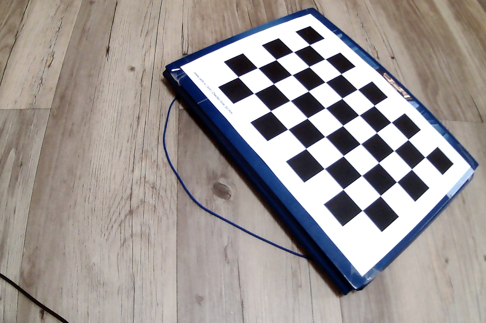
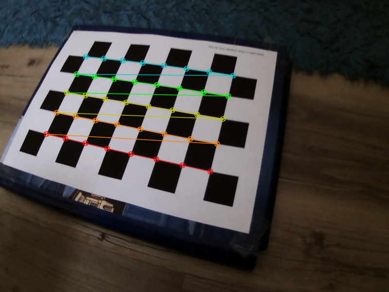
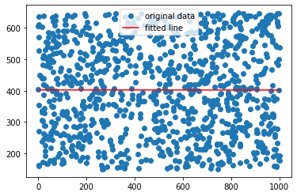
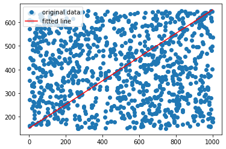
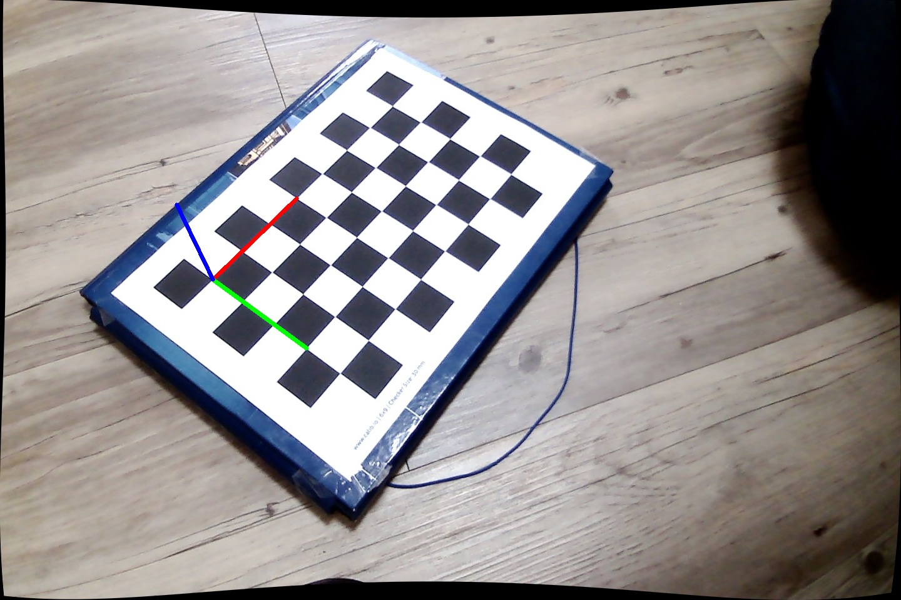
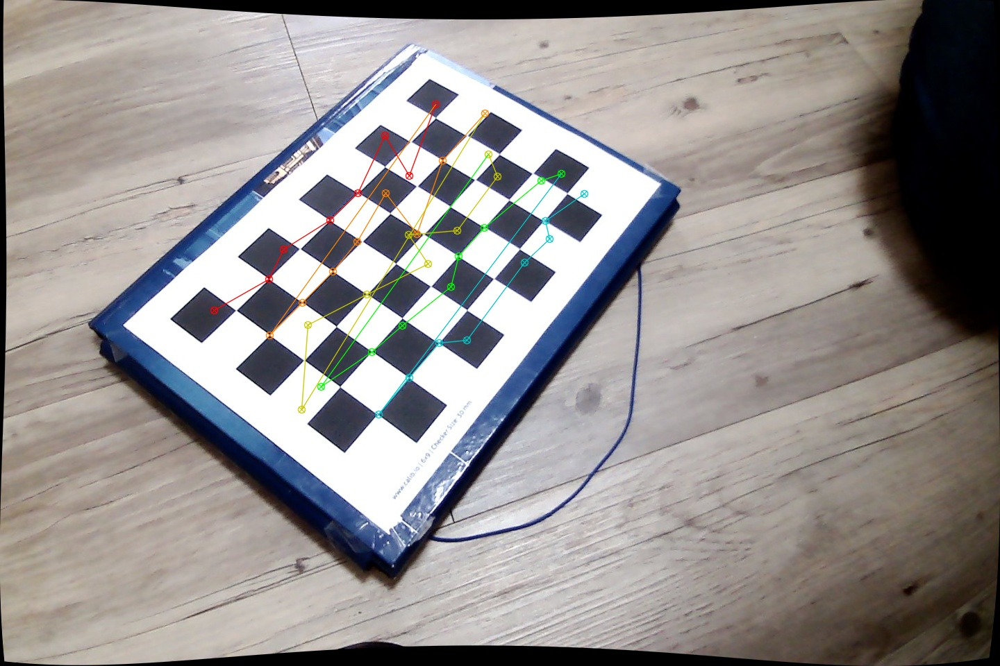
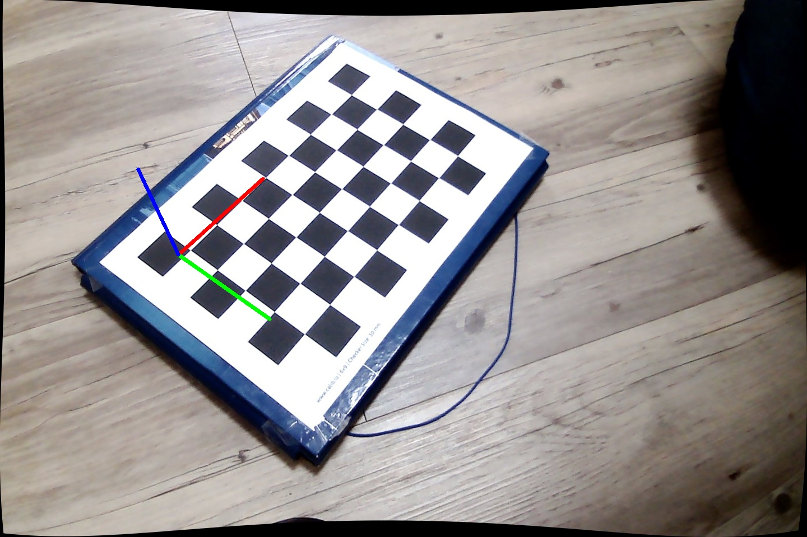

# Intro

During the lecture we have introduced the pinhole camera model.
In the real world cameras have lenses. To get more intuition on
how the focal length and aperture influence the depth of field
we recommend going through [this blogpost](https://ciechanow.ski/cameras-and-lenses/)
with great visualizations.
During the lab session do not spend more than 15 minutes on the blogpost
to have enough time for the rest of the lab scenario.

# General info

During this lab we are going to calibrate the provided cameras based on the series of images captured.

This will be the first time we will work with OpenCV locally.
It should not be too different from the Colab, but remember to call `cv2.waitKey()` after every `cv2.imshow()`.
Installing should be simple: you can use your distro package manager or pip.

```bash
# Ubuntu
sudo apt-get install python3-opencv
# Arch, etc.
sudo pacman -S python-opencv
```

Or with pip in a venv:

```bash
python3 -m venv opencv_venv
. opencv_venv/bin/activate # Use this line every time you open a new terminal session
pip install opencv-python
python -c 'import cv2' # Check if module was found
```

[This resource](https://docs.opencv.org/4.x/dc/dbb/tutorial_py_calibration.html) can be useful as a reference.

# Distortions

Our camera introduce distortion to images. We will take care only of two types of distortions
during this lab:
- radial distortion and 
- tangential distortion.

Radial distortion causes straight lines to appear curved.


Tangential distortion makes a "tilted" effect. 


Our goal is to undistort series of images taken by a camera and have a stream with realtime undistortion.

# Dataset

We have provided a dataset of images in the `data` folder. Take a look at the first image:



[Here](calib_pattern.pdf) you can find a chessboard pattern that is used for calibration.

# Tasks

:white_check_mark: **Finding the chessboard** using functions:

- [`cv2.findChessboardCorners`](https://docs.opencv.org/4.8.0/d9/d0c/group__calib3d.html#ga93efa9b0aa890de240ca32b11253dd4a) - finding chessboard corners (returns series of floats)
  - Please note that parameter `patternSize` expects number of corners between checkers, e.g. 8x5 with 9x6 checkerboard
- [`cv2.cornerSubPix`](https://docs.opencv.org/4.8.0/dd/d1a/group__imgproc__feature.html#ga354e0d7c86d0d9da75de9b9701a9a87e) -  more exact corner positions
- [`cv2.drawChessboardCorners`](https://docs.opencv.org/4.8.0/d9/d0c/group__calib3d.html#ga6a10b0bb120c4907e5eabbcd22319022) - drawing chessboard corners on the image

write a program, that takes a folder of pictures, finds chessboard in every picture, and either draws the chessboard or reports that it could not find one.

Function `cv2.cornerSubPix` expects five parameters:
- image, note that it is required for the image to be single channel, so conversion using `cv2.cvtColor(img, cv2.COLOR_BGR2GRAY)` is necessary,
- corners detected by `findChessboardCorners`,
- half of the side length of the search window (we suggest `(11,11)`),
- half of the size of the dead region in the middle of the search zone (we suggest `(-1, -1)` meaning no zone),
- criteria for termination of the iterative process of corner refinement (we suggest: `criteria = (cv2.TERM_CRITERIA_EPS + cv2.TERM_CRITERIA_MAX_ITER, 30, 0.001)`).


Example output:


:white_check_mark: **Camera calibration** 

In the same program as above, using
- [`cv2.calibrateCamera`](https://docs.opencv.org/4.8.0/d9/d0c/group__calib3d.html#ga3207604e4b1a1758aa66acb6ed5aa65d)

find the rotation and translation vectors estimated for each pattern view, intrinsic parameters (3x3 camera matrix) together with distortion coefficients.

`calibrateCamera` takes `objpoints` (3D), so you should prepare an array of those points.
Write a function that takes checker width, number of corners vertically and horizontally and outputs object points.
For example for 30mm chessboard pattern and 4x5 checkers it could look like `(0,0,0), (30,0,0), (60,0,0) ....,(90,60,0)`
(`np.mgrid()` is a nice numpy function you may want to know). 
In this example the unit we used for `objpoints` was millimeters.
Note that if we have 4x5 checkers we have 3x4 intersection corners between checkers,
so with our 9x6 calibration checkerboard you should generate 40 object points.
Also, `objpoints` should have type `np.float32` (the default of `np.float64` will not work).

`calibrateCamera` takes `cameraMatrix` and `distCoeffs` as arguments, even though we want to find them.
This is because, by setting some non-default flags in `calibrateCamera`, the function utilizes the initial values provided for these arguments.
In our case, we should use:

```python
cameraMatrix = None, distCoeffs = None
```


:white_check_mark: **Undistort images**

Now that we have our camera calibrated we can undistort the images.
We could use
[`cv2.undistort`](https://docs.opencv.org/4.8.0/d9/d0c/group__calib3d.html#ga69f2545a8b62a6b0fc2ee060dc30559d) function to simply undistort an image.
However it is much faster to compute the undistortion and rectification transformation map using [`cv2.initUndistortRectifyMap`](https://docs.opencv.org/4.8.0/d9/d0c/group__calib3d.html#ga7dfb72c9cf9780a347fbe3d1c47e5d5a) and then reuse
these maps multiple times with [`cv2.remap`](https://docs.opencv.org/4.8.0/da/d54/group__imgproc__transform.html#gab75ef31ce5cdfb5c44b6da5f3b908ea4).

You can use following parameters for `cv2.initUndistortRectifyMap` and `cv2.remap`:

```python
R = np.eye(3), m1type=cv2.CV_32FC1, interpolation=cv2.INTER_LINEAR
```

while providing your own `cameraMatrix=..., distCoeffs=..., size=..., newCameraMatrx=...` parameters.

Take a look at
`cv2.initUndistortRectifyMap()` documentation for mathematical details.
As a reminder from lab2 [`cv2.getOptimalNewCameraMatrix()`](https://docs.opencv.org/4.8.0/d9/d0c/group__calib3d.html#ga7a6c4e032c97f03ba747966e6ad862b1) can be useful and `alpha` parameter should be chosen so that desired behaviour is achieved.
Decide if it is better to retain all pixels or work with filled field of view.

Write a program that reads images and shows both distorted (original) and undistorted images side-by-side (or one above the other).


# RANSAC

Random sample consensus (RANSAC) is an iterative method to estimate parameters of a mathematical model from a set of observed data that contains outliers, when outliers are to be accorded no influence on the values of the estimates [(wiki)](https://en.wikipedia.org/wiki/Random_sample_consensus)

It can be useful when we are estimating a pose based on positions of features (in pixel space), some
of which are terribly misplaced. To begin with we will start with our own version of RANSAC.

We will start with some almost random data (only 5% of points - almost linear function, 95% - random noise)

```python
import random
import matplotlib.pyplot as plt
from scipy import stats
import numpy as np

def value(alpha = 0.95):
    x = 1000 * random.random()
    y = 0.5 * x + random.gauss(0, 3) + 150
    if random.random() < alpha:
        y = random.uniform(150, 650)
    return x, y

values = [value() for _ in range(1000)]
values.sort()

x = np.array([v[0] for v in values])
y = np.array([v[1] for v in values])
res = stats.linregress(x, y) 
plt.plot(x, y, 'o', label='original data')
plt.plot(x, res.intercept + res.slope*x, 'r', label='fitted line')
plt.legend()
plt.show()
```



As we can see linear regression from stats package found a line that tries to fit both the data and the noise.

Can we do it better?

Let's take a look at an RANSAC algorithm:

```
Given:
    data – A set of observations.
    model – A model to explain observed data points.
    n – Minimum number of data points required to estimate model parameters.
    k – Maximum number of iterations allowed in the algorithm.
    t – Threshold value to determine data points that are fit well by model.
    
Return:
    bestFit – model parameters which best fit the data (or null if no good model is found)

iterations = 0
bestPointCount = 0

while iterations < k do
    maybeInliers := n randomly selected values from data
    maybeModel := model parameters fitted to maybeInliers
    alsoInliers := empty set
    for every point in data not in maybeInliers do
        if point fits maybeModel with an error smaller than t
             add point to alsoInliers
        end if
    end for
    if the number of elements in maybeInliers and alsoInliers is > bestPointCount then
        // This implies that we may have found a good model
        betterModel := model parameters fitted to all points in maybeInliers and alsoInliers
        bestPointCount := number of elements in maybeInliers and alsoInliers
    end if
    increment iterations
end while

return bestFit
```

We could use it  with following parameters:

* `k` - number of iterations set to `1000`
* `n` - number of elements in sample set to `2` (only two points!)
* `t` - threshold (squared distance) set to `10`

In our solution results are following:



As we can see algorithm is able to overcome `95%` of noise.

:white_check_mark: Fill the TODOs:

```
best_diff = None
for k in range(100):
    sample = random.sample(values, 2)
    # TODO: perform linear regression based on sample
    # TODO: add datapoints to alsoInliers
    # TODO: calc how many points are in maybeInliers and alsoInliers
    # TODO: update the best model if needed
    # TODO: plot the results
```


# Pose estimation using solvePnP


Pose estimation is a task of estimating rotation (output) and the translation (output) vectors that transform a 3D point expressed in the object coordinate frame to the camera coordinate frame from correspondence between 2D points on photo (input) and 3D points of objects (input). [3D pose estimation](https://en.wikipedia.org/wiki/3D_pose_estimation)

[`cv2.solvePnP`](https://docs.opencv.org/4.8.0/d9/d0c/group__calib3d.html#ga549c2075fac14829ff4a58bc931c033d) function is one of many OpenCV functions able to perform pose estimation (without using RANSAC)
[docs](https://docs.opencv.org/4.x/d9/d0c/group__calib3d.html#ga549c2075fac14829ff4a58bc931c033d).

As parameters it takes:
* array of object points in the object coordinate space (3D)
* array of corresponding image points (2D)
* cameraMatrix estimated by `cv2.calibrateCamera`
* distCoeffs estimated by `cv2.calibrateCamera`

In fact, we have already used `cv2.solvePnP` in lab3, it was disguised as `my_estimatePoseSingleMarkers`, but actually it was just solveP4P from four corners of a marker.
    
In the begining of this lab we have estimated cameraMatrix and distCoeffs of our cameras. We can find chessboard corners on the image using `cv2.findChessboardCorners` function. We also know our chessboard object measurements.

:white_check_mark: Using `cv2.solvePnP` and [`cv2.projectPoints`](https://docs.opencv.org/4.8.0/d9/d0c/group__calib3d.html#ga1019495a2c8d1743ed5cc23fa0daff8c) (projects 3D points to 2D image, refer to lab3) write a program that draws 3D coordinate system with (0,0,0) at one corner of the chessboard
with X, Y and Z axes as on image below:



You can use following code for drawing axes
```python
def coordinates(point):
    return [int (i) for i in tuple(point.ravel())]

def draw(img, corners, imgpts):
    # WARNING: openCV uses BGR color space
    corner = coordinates(corners[0].ravel())
    img = cv.line(img, corner, coordinates(imgpts[0]), (0,0,255), 5)
    img = cv.line(img, corner, coordinates(imgpts[1]), (0,255,0), 5)
    img = cv.line(img, corner, coordinates(imgpts[2]), (255,0,0), 5)
    return img
```

Use the images from `data` directory to test your code.

# Noisy data

Sometimes the data points may be noisy what can lead to poor results in pose estimation like on the image below:





:white_check_mark:

1. Make the output of `cv2.findChessboardCorners` noisy by adding some artificial noise to `cv2.findChessboardCorners` result. For example choose a few points to disturb slightly and choose a few points to make them completely random.
2. Check (with your eyes) the results of `cv2.solvePnP` on noisy data.
3. Implement your own version of `cv2.solvePnP` with RANSAC (only use `cv2.solvePnP`, RANSAC implementation should be yours).

:white_check_mark:

Compare your results with
[`cv.solvePnPRansac`](https://docs.opencv.org/4.x/d9/d0c/group__calib3d.html#ga50620f0e26e02caa2e9adc07b5fbf24e). Check:
- accuracy (with your own eyes or against original, not disturbed data)
- running speed
- check against different RANSAC parameters
