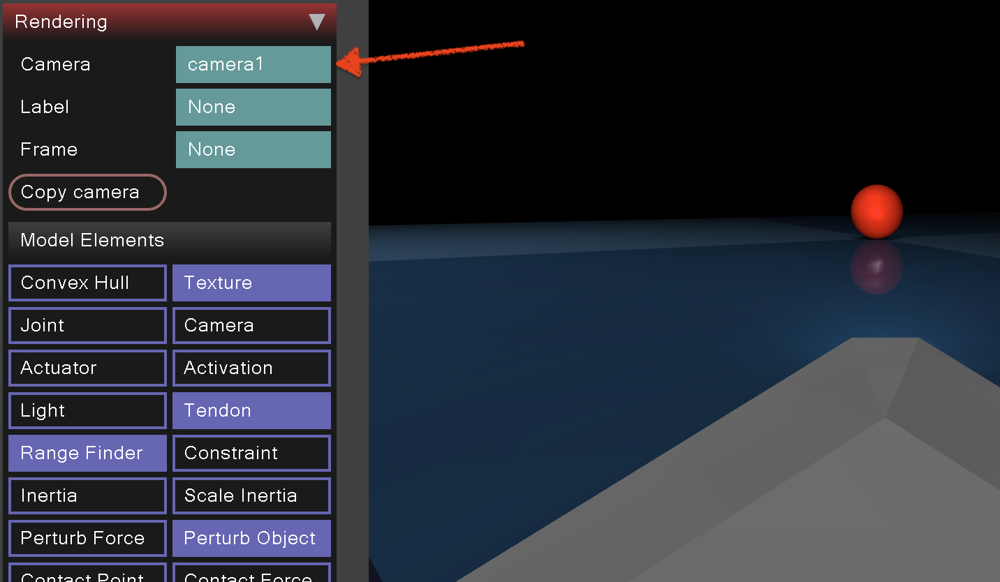
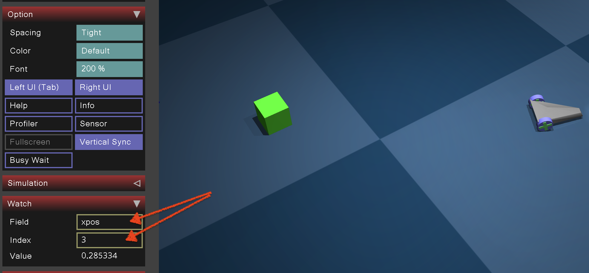
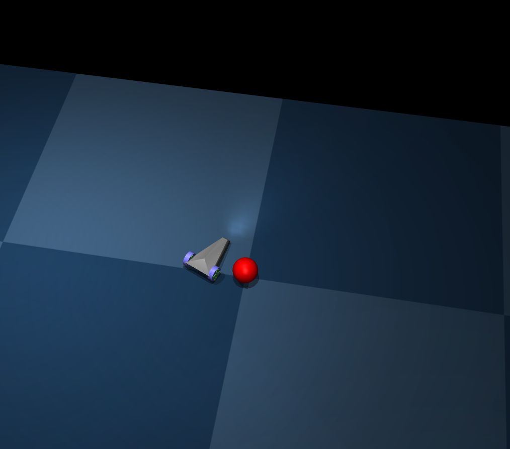
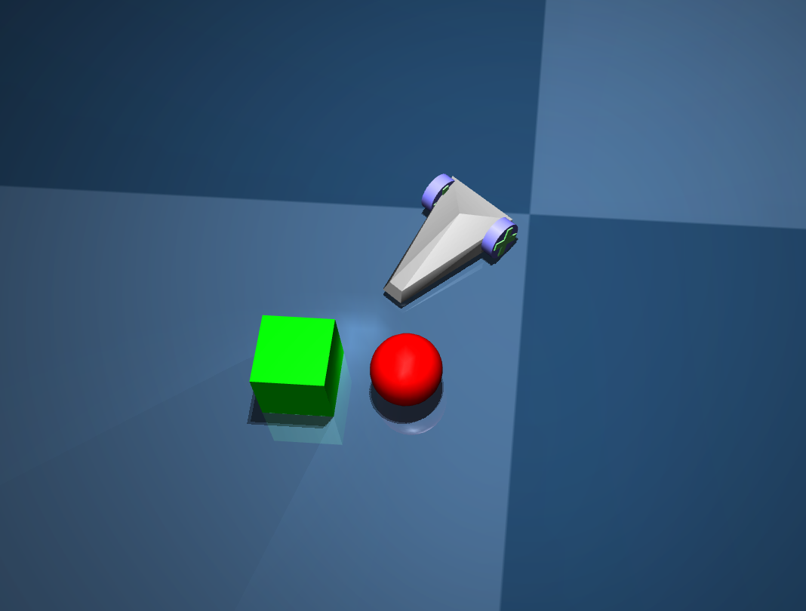
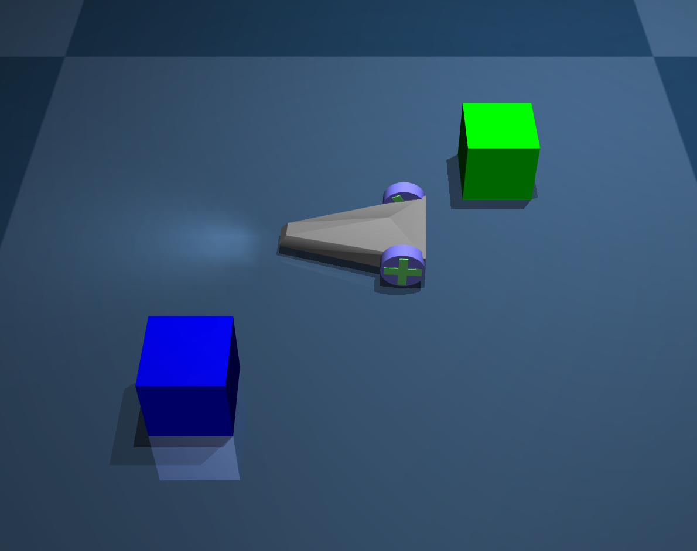

# Updates

Not yet

# Submission format

**The submission deadline is Dec 18 (Monday), 8:00am 2023.**
 
You should submit via moodle.

# DESCRIPTION

You are given a `car.xml` file that contains information about car and a camera.

Your task is to write a program that performs the following three tasks:
1. Drive the car to the destination point (red ball), without touching this ball.
2. Bring red ball close to the green box (less than 0.25 distance) whithout moving the box too much (less than 0.1 distance).
3. Drive the car to the destination, between two boxes.

Each task is described in more detail below.

You should write your code in `stub.py` file. You can use any python libraries you want.

We encourage you to use `numpy` and `opencv` libraries.

Every task gets the same number of points.

# Preparation

Read the `car.xml` file and `stub.py` file. You should understand the code in `stub.py` file.


Try to play with the simulator and preform all the tasks manually. Don't forget about setting the correct camera.



Also don't forget to check coordinates of the car and the ball. You can do it by printing `data.body("car").xpos` and `data.body("ball").xpos` in the console or by looking at `xpos` in the simulator (indexes 3 and 4).




## Stub

You are given the `stub.py` code, that you are supposed to complete.

There is a function `sim_step(forward, turn)` that drives with specified forward and turn parameters for `steps` simulation steps.

It basically does the following:

```python
def sim_step(forward, turn, steps):
    data.actuator("forward").ctrl = forward
    data.actuator("turn").ctrl = turn
    for _ in range(steps):
        mujoco.mj_step(model, data)
    renderer.update_scene(data, camera="camera1")
    img = renderer.render() # img is a numpy array of size (height, width, 3)
    return img
```

In all the tasks you should not read any positions from the simulator, you should use only `img` that is returned by `sim_step` function.

## Viewing images

It's hard to display images using both MuJoCo and OpenCV, so we recomend you to use `PIL` library to display images, because it spawns a new process for each image.

# Task 1

During the first task, your goal is to drive the car to the destination point (red ball), without touching this ball.

At the end, your car should be close to the red ball (0.2 distance is fine). The result could for instance look like this:




For car control, you should use only `task_1_step(turn)` function, that drives forward with 0.1 speed with specified turn for 200 simulation steps.

At the beginig car will be in the random position, because before your code, there is a  code that sets the position of the car:

```python
steps = random.randint(0, 2000)
img = sim_step(0, 0.1, steps, view=False)
```

This exact code will be used for evaluation, so you should not change it.

# Task 2

During the second task, your goal is to bring red ball close to the green box (less than 0.25 distance) whithout moving the box too much (less than 0.1 distance).

You can see expected result below:



As you can see, the ball is not directly before the car, because after the car stops, the ball is still moving.

As in the first task, yout car is in the random position.

```python
sim_step(0.5, 0, 1000, view=True)
speed = random.uniform(0.3, 0.5)
turn = random.uniform(-0.2, 0.2)
img = sim_step(speed, turn, 1000, view=True)
```

For car control, you should use only `sim_step(forward, turn, steps)` function, that drives with specified forward and turn for 1000 simulation steps.

Your code should run in less than 10 seconds (turn visualization off).

# Task 3

In the third task you will be dealing with the car drift. Your goal is to drive the car to the destination, between two boxes, like this:



However, the car is drifting, so you should not use `sim_step` function this time, but `task3_step`.

At the begining task_3 selects random drift value:

```python
def task_3():
    global drift
    drift = np.random.uniform(-0.1, 0.1)
    ...
```

and then it uses it in `task3_step` function:
    
```python
def task3_step(forward, turn, steps=1000, view=False):
    sim_step(forward, turn + drift, steps=steps, view=view)
```

So instead of driving with `turn` parameter, car drives with `turn + drift` parameter driftin in the random direction.
